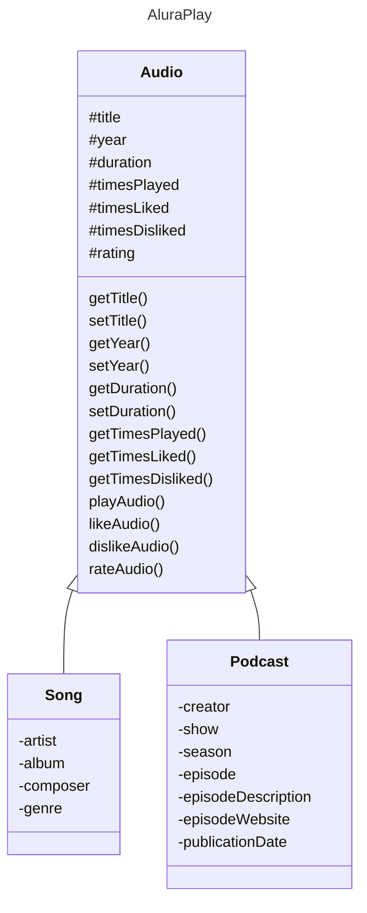

# AluraPlay audio player

This is a small project developed during the course 
[Java: aplicando a Orientação a Objetos](https://cursos.alura.com.br/course/java-aplicando-orientacao-objetos)
\[Java: applying object orientation\]
of the [Alura School](https://www.alura.com.br/).

The goal is to model an audio player software using Java and OOP concepts
(encapsulation, inheritance, and polymorphism).

## Initial modeling

The diagram below shows the very first concept of the project.

